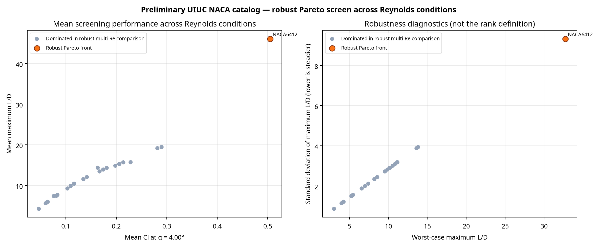

# تحلیل پارامتریک چندهدفه با آگاهی از رینولدز — v3.1.2

**نویسنده:** Manus AI  
**تاریخ اجرا:** ۱۴ اوت ۲۰۲۶  
**حکم استفاده:** **غربال‌گری مقدماتی مهندسی؛ نه نتیجهٔ viscous معتبر، نه دادهٔ تونل باد و نه مبنای طراحی ایمنی‌-بحرانی.**

این مطالعه، ۲۴ هندسهٔ NACA انتخاب‌شده از پایگاه UIUC را در پنج شرط رینولدز بررسی می‌کند. UIUC مختصات حدود ۱٬۶۵۰ ایرفویل را منتشر می‌کند و به تفاوت قراردادهای ترتیب نقاط در فایل‌های خود اشاره دارد؛ parser پروژه هر دو قرارداد متداول را پشتیبانی می‌کند. [1] [2] در این اجرای مشخص، هر ۲۴ پروفیل در دسترس بودند و هیچ profile مفقودی ثبت نشد.

## هدف و روش

هدف از این تغییر، جایگزین‌کردن رتبه‌بندی تک‌نقطه‌ای با غربال‌گری‌ای است که **اثر دامنهٔ رینولدز** را در خود تعریف Pareto لحاظ می‌کند. روش جدید `screen_geometries_multi_re()` برای هر هندسه، polar مقدماتی را در تمام شرایط اجرا می‌کند، شاخص‌های تجمیعی را گزارش می‌دهد و در عین حال رتبهٔ front را با همان aggregateها تعیین نمی‌کند.

> یک کاندید در **Robust Pareto Front** قرار دارد اگر هیچ کاندید دیگری نتواند هم‌زمان در «حداکثر L/D» و «هدف Cl» در *تمام* شرایط رینولدز، حداقل برابر و در دست‌کم یک مؤلفه بهتر باشد.

| مولفه | تنظیم اجرای ثبت‌شده |
|---|---|
| کاندیدها | ۲۴ هندسهٔ NACA از کاتالوگ UIUC |
| رینولدزها | 100k، 250k، 500k، 1.0M و 2.0M |
| envelope زاویه حمله | −4° تا +12°، گام 1° |
| هدف اول Pareto | بیشینهٔ L/D در هر شرط رینولدز |
| هدف دوم Pareto | `Cl` در زاویهٔ طراحی 4°، در هر شرط رینولدز |
| roughness | `k/c = 0.0` |
| مدل فعلی | panel/empirical سبک پروژه؛ فقط برای screening |
| artifact بازتولیدپذیری | `scripts/run_pareto_multi_re.py` + CSV + JSON manifest |

شاخص‌های `mean_best_ld`، `worst_case_best_ld` و `best_ld_std` برای خوانایی و تصمیم‌سازی استفاده شده‌اند؛ **هیچ‌کدام به‌تنهایی تعریف front نیستند.** بنابراین روش جدید، گزینه‌ای را که فقط در میانگین خوب است اما در بخشی از envelope مغلوب می‌شود، به‌اشتباه robust معرفی نمی‌کند.

## نتیجهٔ اجرای فعلی

در candidate set و envelope مشخص‌شده، تنها عضو Robust Pareto Front عبارت است از **UIUC NACA6412**. این خروجی به معنی «بهترین ایرفویل برای همهٔ کاربردها» نیست؛ فقط بیان می‌کند که در مدل و دامنهٔ محدود این مطالعه، هیچ‌یک از ۲۳ کاندید دیگر نتوانست هم‌زمان هر ده objective (دو objective در پنج Re) را بر آن غالب کند.

| شاخص NACA6412 | مقدار |
|---|---:|
| میانگین بیشینهٔ L/D | 46.08 |
| بدترین بیشینهٔ L/D در sweep | 32.74 در Re=100k |
| بهترین بیشینهٔ L/D در sweep | 59.46 در Re=2.0M |
| انحراف معیار بیشینهٔ L/D | 9.33 |
| میانگین Cl در α=4° | 0.5047 |
| حداقل Cl در α=4° | 0.5047 |
| ضخامت هندسی استخراج‌شده | 12.04% chord |
| camber هندسی استخراج‌شده | 6.00% chord |



نمودار سمت چپ، metrics میانگین را برای تفسیر نشان می‌دهد؛ نمودار سمت راست نسبت بدترین L/D و پراکندگی آن را نمایش می‌دهد. فاصلهٔ واضح NACA6412 در نمودار، فقط نشانهٔ رفتار **این مدل screening** برای هندسهٔ 6%-camber است، نه تأیید تجربی superiority.

## مقایسهٔ مرجع درون همین اجرا

برای کنترل مقیاس، NACA6412 با NACA4412 — یک مرجع 12%-thick و 4%-camber از همان set — مقایسه شده است. درصدها از مقادیر خام CSV محاسبه شده‌اند و صرفاً اختلاف مدل را بیان می‌کنند.

| شاخص | UIUC NACA6412 | UIUC NACA4412 | اختلاف مدل نسبت به NACA4412 |
|---|---:|---:|---:|
| میانگین بیشینهٔ L/D | 46.08 | 10.42 | +340% |
| بدترین بیشینهٔ L/D | 32.74 | 7.41 | +340% |
| Cl در α=4° | 0.5047 | 0.1164 | +330% |
| رتبهٔ robust Pareto | 1 | 13 | — |

این اختلاف بزرگ باید به‌عنوان **علامت نیاز به validation** تلقی شود، نه ادعای محصول. مدل سبک فعلی، وابستگی Reynolds را عمدتاً از مدلسازی drag می‌گیرد و ویژگی‌های viscous مانند transition، laminar-separation bubble، separation و post-stall را حل نمی‌کند. به‌ویژه پایداربودن `Cl` در α=4° در سراسر Reهای این اجرا، یک محدودیت شناخته‌شدهٔ مدل است؛ در یک solver viscous یا آزمایش واقعی، انتظار می‌رود وابستگی‌های بیشتری دیده شود.

## تفسیر مهندسی و اقدام بعدی

خروجی فعلی برای **کاهش فضای جست‌وجو** مفید است: NACA6412 را به یک shortlist آزمایشی منتقل می‌کند و NACA4424 و NACA2424 را به‌عنوان نزدیک‌ترین رتبه‌های بعدی این set نگه می‌دارد. برای تصمیم طراحی، لازم است هندسهٔ shortlist با XFOIL/QFOIL دارای تنظیمات transition/Ncrit شفاف، سپس با polar تونل باد یا dataset معتبر هم‌شرط Re و roughness اعتبارسنجی شود. XFOIL برای تحلیل زیرصوت ایرفویل، شامل viscous/inviscid analysis و drag polar با Reynolds/Mach است، اما خود آن نیز جایگزین validation آزمایشگاهی نیست. [3]

| گام بعدی | معیار پذیرش پیشنهادی |
|---|---|
| تکرار با XFOIL worker | ذخیرهٔ version solver، Ncrit، transition، convergence و raw polar برای هر Re |
| حساسیت roughness و transition | front در چند `k/c` و چند Ncrit گزارش شود، نه فقط سطح صاف |
| اعتبارسنجی | MAE/RMSE/bias برای Cl و Cd در برابر دادهٔ هم‌شرط ثبت شود |
| انتخاب مهندسی | محدودیت ضخامت، moment، ساخت‌پذیری، flap، structural envelope و operating mission وارد objective شود |
| کنترل انتشار | تمام resultها با عبارت «preliminary screening» و manifest study همراه باشند |

## فایل‌های خروجی و بازتولید

| فایل | نقش |
|---|---|
| `scripts/run_pareto_multi_re.py` | runner بازتولیدپذیر مطالعه |
| `analysis_outputs/pareto_multi_re/pareto_multi_re_rankings.csv` | رتبه‌ها و summary metric تمام ۲۴ profile |
| `analysis_outputs/pareto_multi_re/pareto_multi_re_condition_metrics.csv` | metric هر profile در هر Re |
| `analysis_outputs/pareto_multi_re/pareto_multi_re.png` | visualization front و robustness diagnostics |
| `analysis_outputs/pareto_multi_re/pareto_multi_re_manifest.json` | منابع مختصات، تنظیمات، محدودیت‌ها و provenance |
| `analysis_outputs/pareto_multi_re/pareto_multi_re_summary.json` | summary سبک برای dashboard یا ارائه |

برای تکرار اجرای پیش‌فرض:

```bash
python scripts/run_pareto_multi_re.py
```

## منابع

[1]: https://m-selig.ae.illinois.edu/ads/coord_database.html "UIUC Airfoil Coordinates Database"
[2]: https://m-selig.ae.illinois.edu/ads.html "UIUC Airfoil Data Site — Format and provenance notes"
[3]: https://web.mit.edu/drela/Public/web/xfoil/ "XFOIL — Mark Drela, MIT"
